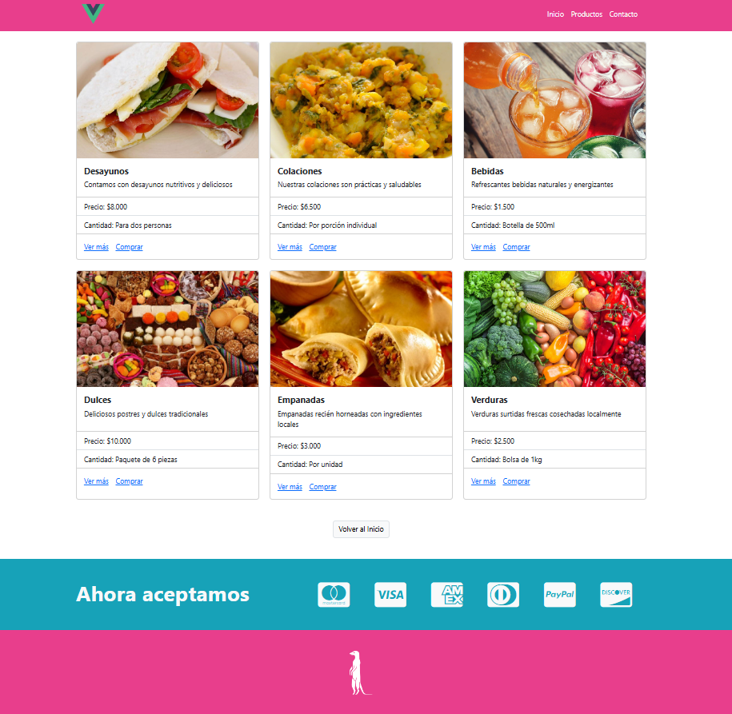

# **NAVIGATION IN A WEB INTERFACE WITH VUE ROUTER**

Through this web interface, you can enable a navigation menu using Vue Router.


## **Technologies Used**
- **Vue.js**
- **Vue Router**
- **JavaScript**
- **Bootstrap**
- **HTML5**
- **CSS3**
- **Fontawesome**

## **Features**
1. **Dynamic Navigation Menu**
   - Utilizes `<router-link>` to create a fully functional navigation menu.
   - Seamless navigation between different views within the application.

2. **Lazy Loading for Routes**
   - Routes are configured to load components dynamically using lazy loading, optimizing performance.

3. **Modular Components**
   - Includes well-structured components for the Navbar, Card, Footer, and Payment Methods, ensuring reusability and maintainability.

4. **Route-Driven Views**
   - Each navigation menu item has a corresponding view:
     - **Home**
     - **Products**
     - **Contact**

5. **Redirection Links**
   - Includes redirection links in the **Products** and **Contact** views to return to the Home page easily.

6. **Props in the Products View**
   - The **Products.vue** view receives props directly from route definitions, enabling dynamic display of:
     - Name
     - Description
     - Price
     - Quantity

7. **Directory-Based View Organization**
   - All views are neatly organized into their respective directories, simplifying project structure.

8. **Scalable Codebase**
   - Built on a predefined codebase, ensuring a scalable and professional structure for further development.

## Customize configuration

See [Vite Configuration Reference](https://vite.dev/config/).

## Project Setup

```sh
npm install
```

### Compile and Hot-Reload for Development

```sh
npm run dev
```

### Compile and Minify for Production

```sh
npm run build
```

## **Screenshots**
<p align="center">
  
</p>
